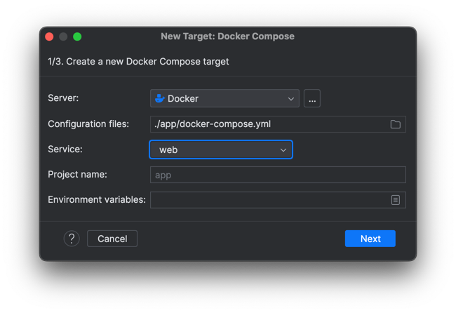
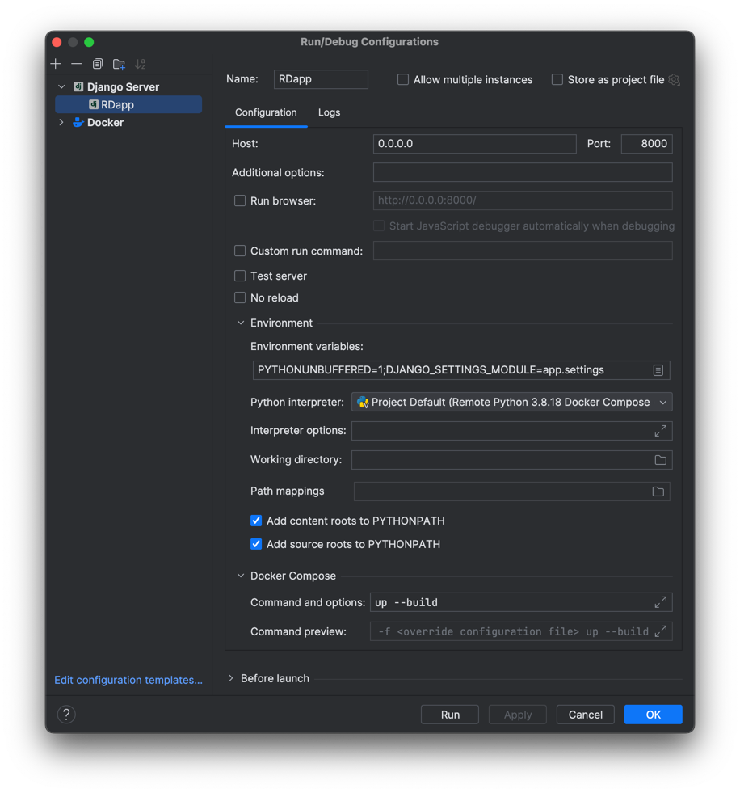
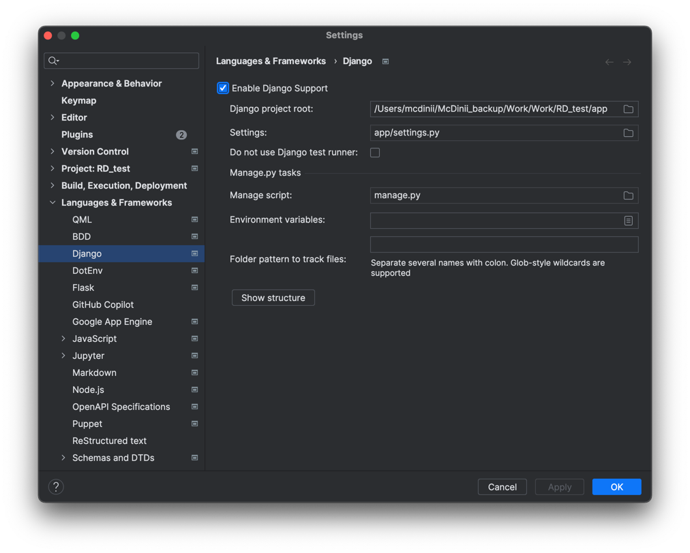

## Django+PostgresSQL+Celery+Redis+Gunicorn in Docker

### For fast project starting use "docker-compose up --build" from "RD_test/app/"
#### it will run all that you need automatically, and also create data, and super user like admin admin

---

If you are using PyCharm and want a quick start with debugging the container, you can set up a configurator:

1. Add a Remote Docker-Compose Interpreter:
    - Add a new interpreter.
    - Select "Docker Compose".
    - Configure it as shown in the image below:  
    
    
2. Then go to "Run/Debug Configurations" and add a "Django Server":
    - Write "0.0.0.0" in the "Host" field.
    - Write "up --build" in the "Command and options" field.  
    
    - You will also need to enable "Django support" as prompted by the IDE:
        - Provide the paths to Django files as required. See the image below:  
        

3. Provide your `.env` file with the following variables:
    - DB_NAME
    - DB_USER
    - DB_PASSWORD
    - DB_HOST
    - DB_PORT
    - SECRET_KEY
    - DEBUG
    - ALLOWED_HOSTS

4. ## Rocket IT!